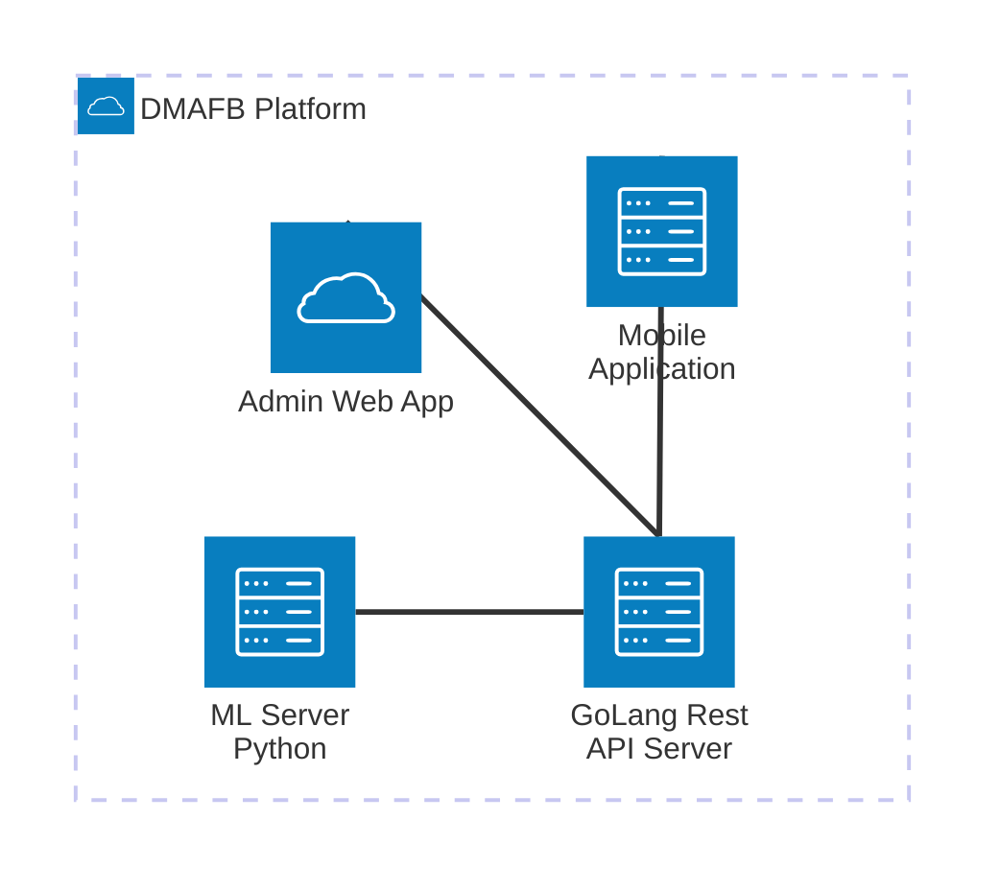

# Do Me A Favor Buddy (DMAFB): Monorepo  

## Components of the Platform

1. Mobile Frontend
3. Web Frontend
2. Backend
3. Data Analysis and Machine Learning Server

## Architecture Diagram

## Tech Stack
1. **Mobile Application** : React Native, Expo.
2. **Backend Application**: Golang with Echo and Mongodb.
3. **Admin Web Application**: React and Typescript
4. **Machine Learning Server**: Python with Starlette, keras, and tensorflow for ML
5. **ML Models and Algorithms**: XGBoost, LSTM and TBD

## References
1. https://expo.dev/
2. https://echo.labstack.com/
3. https://docs.python.org/3/
4. https://go.dev/doc/
5. https://keras.io/
6. https://www.tensorflow.org/
7. https://mermaid.js.org
8. https://www.typescriptlang.org/
9. https://numpy.org/
10. https://pandas.pydata.org/docs/
11. https://starlette.dev/
